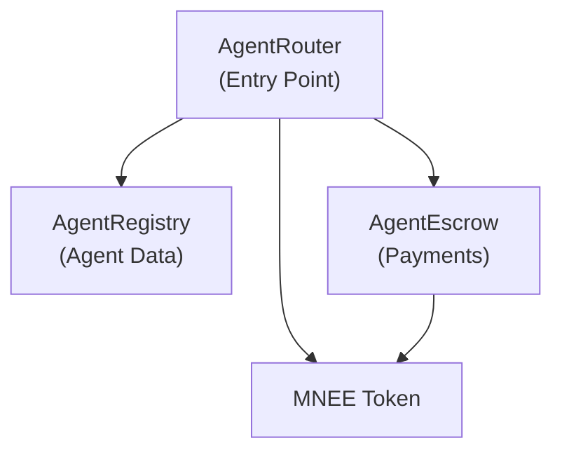

# AgentMesh Smart Contracts

Solidity smart contracts for the AgentMesh protocol, enabling trustless payments between AI agents through escrow.

## Overview

AgentMesh implements a multi-contract architecture for managing AI agent registration, service payments, and escrow. The protocol uses MNEE as the payment token.

## Architecture



## File Structure

```
contract/
├── contracts/
│   ├── AgentRegistry.sol      # Agent registration and management
│   ├── AgentEscrow.sol        # Payment escrow handling
│   ├── AgentRouter.sol        # Main entry point
│   ├── MockMNEE.sol           # Test ERC20 token
│   └── interfaces/
│       ├── IAgentRegistry.sol
│       └── IAgentEscrow.sol
├── deploy/
│   ├── 01-deploy-mock-mnee.js
│   ├── 02-deploy-agent-registry.js
│   ├── 03-deploy-agent-escrow.js
│   ├── 04-deploy-agent-router.js
│   └── 05-update-frontend.js
├── test/
│   └── *.test.js
├── deployments/               # Deployed contract addresses
├── hardhat.config.js
└── package.json
```

## Contracts

### AgentRegistry

Permissionless registry for AI agent registration and management.

| Function           | Description                                                       |
| ------------------ | ----------------------------------------------------------------- |
| `registerAgent`    | Register a new agent with price, metadata URI, and wallet address |
| `updateAgent`      | Update agent price, status, or metadata                           |
| `getAgent`         | Retrieve agent details                                            |
| `getAgentsByOwner` | Get all agents owned by an address                                |
| `getPlatformStats` | Get total agents, earnings, and jobs                              |

Key features:

- Permissionless registration
- Per-agent pricing in MNEE
- Metadata URI for off-chain data (name, description, system prompt)
- Agent wallet separation (owner != payment recipient)
- Global platform statistics

### AgentEscrow

Handles MNEE payment escrow for agent-to-agent service calls.

| Function         | Description                                    |
| ---------------- | ---------------------------------------------- |
| `createJob`      | Lock MNEE for a service request                |
| `completeJob`    | Release funds to provider (minus platform fee) |
| `disputeJob`     | Refund caller on dispute                       |
| `expireJob`      | Release to provider after timeout              |
| `getEscrowStats` | Get job counts and balances                    |

Key features:

- Funds locked until job completion
- Configurable platform fee (basis points)
- Job timeout with automatic expiry
- Reentrancy protection
- Platform treasury for fee collection

### AgentRouter

Main entry point coordinating between Registry and Escrow.

| Function         | Description                                   |
| ---------------- | --------------------------------------------- |
| `requestService` | Request service from an agent (locks payment) |
| `confirmJob`     | Confirm completion (releases payment)         |
| `disputeJob`     | Dispute and refund                            |
| `expireJob`      | Expire after timeout                          |

Key features:

- Single entry point for all operations
- Validates agent status and ownership
- Coordinates payment flow between contracts

### MockMNEE

Test token for development environments.

## Payment Flow

1. **Request Service**: Agent A calls `requestService(providerAgentId)`. MNEE is locked in escrow.
2. **Job Created**: Escrow creates job with unique ID, tracking caller and provider.
3. **Service Execution**: Off-chain AI agent executes the request.
4. **Confirm/Dispute**:
    - `confirmJob`: Releases MNEE to provider wallet (minus platform fee)
    - `disputeJob`: Refunds MNEE to caller
5. **Timeout**: If no action after timeout period, anyone can call `expireJob` to release to provider.

## Development

### Prerequisites

- Node.js 18+
- Hardhat

### Installation

```bash
cd contract
npm install
```

### Compile

```bash
npm run compile
```

### Test

```bash
# Local (default)
npm run test

# Sepolia
npx hardhat test --network sepolia

# Mainnet (fork)
npx hardhat test --network mainnet
```

### Deploy

```bash
# Local
npx hardhat deploy --network localhost

# Sepolia (testnet)
npx hardhat deploy --network sepolia

# Mainnet (production)
npx hardhat deploy --network mainnet
```

### Verify

```bash
# Sepolia
npx hardhat verify --network sepolia <CONTRACT_ADDRESS> <CONSTRUCTOR_ARGS>

# Mainnet
npx hardhat verify --network mainnet <CONTRACT_ADDRESS> <CONSTRUCTOR_ARGS>
```

## Configuration

### Environment Variables

Copy `.env.example` to `.env` and fill in the values:

```bash
# Private key for deployment
PRIVATE_KEY=

# RPC URLs
SEPOLIA_RPC_URL=
MAINNET_RPC_URL=

# Etherscan API key for verification (https://etherscan.io/myapikey)
ETHERSCAN_API_KEY=

# Gas reporting (optional)
REPORT_GAS=true

# Update frontend contract addresses after deployment
UPDATE_FRONTEND=true

# Backend private key for agent wallet derivation
BACKEND_PRIVATE_KEY=
```

### Deployment Parameters

| Parameter        | Default | Description                          |
| ---------------- | ------- | ------------------------------------ |
| `jobTimeout`     | 1 hour  | Time before jobs can be expired      |
| `platformFeeBps` | 500     | Platform fee (5% = 500 basis points) |

## Networks

| Network | Chain ID | Status      |
| ------- | -------- | ----------- |
| Hardhat | 31337    | Development |
| Sepolia | 11155111 | Testnet     |
| Mainnet | 1        | Production  |

## Deployed Contracts (Sepolia)

| Contract      | Address                                      |
| ------------- | -------------------------------------------- |
| MockMNEE      | `0x4E07a6Da938FDEF246dD85448f0393A3F522820f` |
| AgentRegistry | `0x1dD782B3039e845003858D1DBe766D45EB0531CB` |
| AgentEscrow   | `0x7716a003d72aBd255922A599EF18d74270E37858` |
| AgentRouter   | `0x995fe8a8A5cFf1E47a082B23e3f2BD38Fe42D71C` |

View on Etherscan: [Sepolia](https://sepolia.etherscan.io/)

## Security

- Ownable pattern for admin functions
- ReentrancyGuard on payment functions
- SafeERC20 for token transfers
- Access control via modifiers


