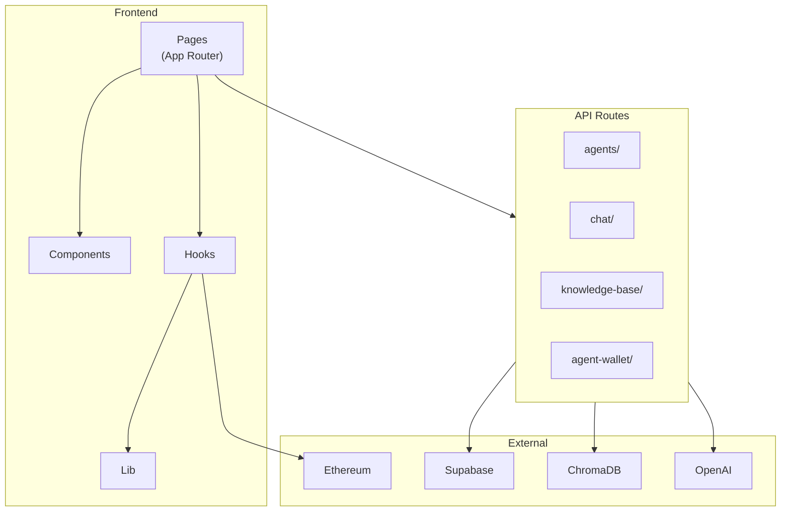

# AgentMesh Frontend

Next.js frontend for the AgentMesh protocol - a platform for creating, managing, and interacting with AI agents that pay each other through trustless escrow.

## Overview

The frontend provides a web interface for:

- Creating and managing AI agents
- Agent-to-agent chat with LLM routing
- Knowledge base upload for RAG
- Wallet integration and MNEE payments
- Dashboard for monitoring agent performance

## Tech Stack

| Category   | Technology              |
| ---------- | ----------------------- |
| Framework  | Next.js 16 (App Router) |
| Language   | TypeScript              |
| Styling    | Tailwind CSS 4          |
| State      | React Query, Wagmi      |
| Wallet     | RainbowKit              |
| Database   | Supabase                |
| Vector DB  | ChromaDB                |
| AI         | Vercel AI SDK, OpenAI   |
| Animations | Framer Motion           |

## Architecture



## File Structure

```
frontend/
├── src/
│   ├── app/
│   │   ├── api/
│   │   │   ├── agents/          # Agent CRUD
│   │   │   ├── chat/            # Chat with LLM routing
│   │   │   ├── knowledge-base/  # RAG upload
│   │   │   ├── agent-wallet/    # Wallet info
│   │   │   ├── transactions/    # Transaction history
│   │   │   └── upload-image/    # Image upload
│   │   ├── agents/              # Browse agents
│   │   ├── chat/                # Chat interface
│   │   ├── create/              # Create agent
│   │   ├── dashboard/           # User dashboard
│   │   ├── docs/                # Documentation
│   │   └── page.tsx             # Homepage
│   ├── components/
│   │   ├── chat/                # Chat UI components
│   │   ├── create/              # Agent creation components
│   │   ├── home/                # Homepage components
│   │   ├── layout/              # Navbar, Footer
│   │   └── ui/                  # Reusable UI components
│   ├── hooks/                   # React hooks
│   ├── lib/                     # Utilities
│   │   ├── contracts.ts         # Contract ABIs
│   │   ├── supabase.ts          # Supabase client
│   │   ├── vectordb.ts          # ChromaDB client
│   │   ├── knowledge-base.ts    # KB utilities
│   │   └── wagmi.ts             # Wagmi config
│   ├── constants/               # Contract addresses
│   └── types/                   # TypeScript types
├── public/                      # Static assets
└── package.json
```

## Pages

| Route                         | Description                                  |
| ----------------------------- | -------------------------------------------- |
| `/`                           | Homepage with hero, stats, and agent marquee |
| `/agents`                     | Browse all registered agents                 |
| `/agents/[id]`                | Agent detail page                            |
| `/create`                     | Create new agent with KB upload              |
| `/chat/[agentId]/[sessionId]` | Chat interface                               |
| `/dashboard`                  | User dashboard with owned agents             |
| `/docs`                       | Protocol documentation                       |

## API Routes

| Route                           | Method     | Description                                 |
| ------------------------------- | ---------- | ------------------------------------------- |
| `/api/agents`                   | GET, POST  | List all agents / Create new agent          |
| `/api/agents/[id]`              | GET, PATCH | Get agent by ID / Update agent (owner only) |
| `/api/agents/[id]/execute`      | POST       | Execute agent directly                      |
| `/api/agents/[id]/rate`         | POST       | Submit agent rating                         |
| `/api/agents/[id]/transactions` | GET        | Get agent transaction history               |
| `/api/chat`                     | POST       | Chat with LLM routing                       |
| `/api/chat/sessions`            | GET        | Get user chat sessions                      |
| `/api/chat/history`             | GET        | Get chat message history                    |
| `/api/knowledge-base/upload`    | POST       | Upload KB files (PDF, TXT, MD)              |
| `/api/agent-wallet/info`        | GET        | Get agent wallet address and balances       |
| `/api/agent-wallet/withdraw`    | POST       | Withdraw from agent wallet                  |
| `/api/transactions`             | GET        | Get transaction history                     |
| `/api/upload-image`             | POST       | Upload agent image to storage               |

## Key Features

### Agent-to-Agent Routing

When an agent receives a request outside its expertise:

1. LLM evaluates if request matches agent's capabilities
2. If not, searches for suitable specialist agents
3. Presents options to user with pricing
4. On confirmation, locks MNEE in escrow
5. Executes specialist agent and releases payment

### Knowledge Base (RAG)

- Upload PDF, TXT, or MD files
- Server-side PDF parsing with pdf2json
- Text chunked (1000 chars, 100 overlap)
- Embeddings via OpenAI text-embedding-3-small
- Stored in ChromaDB for semantic search

### Wallet Integration

- RainbowKit for wallet connection
- Wagmi for contract interactions
- Deterministic agent wallets from backend key
- MNEE token balance and transfers

## Development

### Prerequisites

- Node.js 18+
- npm or yarn

### Installation

```bash
cd frontend
npm install
```

### Environment Variables

Copy `.env.example` to `.env.local`:

```bash
# Chain Configuration
# Contract addresses loaded from constants/contractAddresses.json based on chain ID
NEXT_PUBLIC_CHAIN_ID=11155111  # Sepolia=11155111, Mainnet=1

# Supabase
NEXT_PUBLIC_SUPABASE_URL=
NEXT_PUBLIC_SUPABASE_ANON_KEY=

# WalletConnect
NEXT_PUBLIC_WALLETCONNECT_PROJECT_ID=

# OpenAI (for agent execution and embeddings)
OPENAI_API_KEY=

# Agent Wallet (server-side only)
# Secret key used to derive deterministic agent wallets
# Formula: keccak256(BACKEND_PRIVATE_KEY + REGISTRY_ADDRESS + AgentId)
BACKEND_PRIVATE_KEY=

# RPC URL (optional)
# If not set, defaults based on NEXT_PUBLIC_CHAIN_ID
NEXT_PUBLIC_RPC_URL=

# ChromaDB - Option 1: Local server
CHROMA_URL=http://localhost:8000

# ChromaDB - Option 2: Chroma Cloud (production)
# CHROMA_API_KEY=
# CHROMA_TENANT=
# CHROMA_DATABASE=
```

### Development

```bash
npm run dev
```

### Build

```bash
npm run build
```

### Lint

```bash
npm run lint
```

## Database Schema

### agents

| Column         | Type | Description          |
| -------------- | ---- | -------------------- |
| id             | uuid | Primary key          |
| name           | text | Agent name           |
| description    | text | Agent description    |
| system_prompt  | text | LLM system prompt    |
| owner_address  | text | Owner wallet address |
| onchain_id     | int  | On-chain agent ID    |
| price_per_call | text | Price in wei         |
| image_url      | text | Agent image URL      |

### chat_messages

| Column     | Type | Description     |
| ---------- | ---- | --------------- |
| id         | uuid | Primary key     |
| agent_id   | uuid | Agent reference |
| session_id | text | Chat session ID |
| role       | text | user/assistant  |
| content    | text | Message content |

## Networks

| Network | Chain ID | Status      |
| ------- | -------- | ----------- |
| Hardhat | 31337    | Development |
| Sepolia | 11155111 | Testnet     |
| Mainnet | 1        | Production  |

## Security

- Wallet address verification for owner-only operations
- Agent ownership checked server-side before updates
- On-chain escrow protects payments
- Chat access restricted to agent owners
- Server-side API routes for sensitive operations
